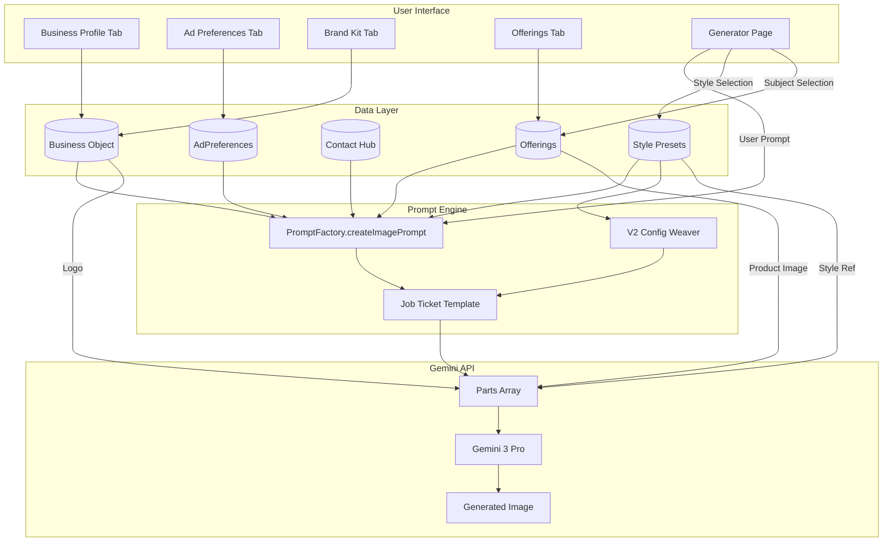

# System Prompt Architecture Audit
> **Purpose**: Source of truth for Gemini Deep Think to redesign our prompt engineering system.

---

## Table of Contents
1. [Executive Summary](#1-executive-summary)
2. [Data Sources](#2-data-sources)
3. [Current Prompt Architecture](#3-current-prompt-architecture)
4. [Dynamic Token Reference](#4-dynamic-token-reference)
5. [Image Attachment Flow](#5-image-attachment-flow)
6. [Data Flow Diagram](#6-data-flow-diagram)
7. [Current Gaps & Pain Points](#7-current-gaps--pain-points)
8. [Deep Think Prompt Template](#8-deep-think-prompt-template)

---

## 1. Executive Summary

**What We Have**: A "Job Ticket" style prompt system that injects business context into Gemini 3 Pro image generation. The prompt is divided into 3 parts:

1. **PART 1 (SOURCE MATERIAL)** — Raw facts about the business (name, slogan, USPs, contact, etc.)
2. **PART 2 (CREATIVE GAPS)** — `[MISSING]` placeholders the AI must fill (headline, body copy, CTA)
3. **PART 3 (VISUAL EXECUTION)** — Render instructions (text integration, subject handling, logo placement)

**Current Flow**:
```
User Prompt + Ad Preferences + Business Profile + Style Preset
                      ↓
          PromptFactory.createImagePrompt()
                      ↓
     Job Ticket (text) + Image Attachments (product, logo, style ref)
                      ↓
              Gemini 3 Pro API Call
```

---

## 2. Data Sources

### 2.1 Business Entity (`types.ts`)

The `Business` object is the **central data hub**. Key fields:

| Category | Field | Description |
|----------|-------|-------------|
| **Identity** | `name`, `type`, `industry`, `description` | Core business info |
| **Brand Kit** | `colors.primary/secondary/accent`, `logoUrl`, `logoVariants`, `typography` | Visual identity |
| **Voice** | `voice.archetype`, `voice.tonePills`, `voice.slogan`, `voice.keywords`, `voice.negativeKeywords`, `voice.tone` | Brand personality |
| **Profile** | `profile.address`, `profile.publicLocationLabel`, `profile.hours[]`, `profile.contacts[]`, `profile.operatingMode` | Operational details |
| **Ad Prefs** | `adPreferences.*` | What to show in ads (see below) |
| **Offerings** | `offerings[]` | Products/Services with images |
| **Audience** | `coreCustomerProfile.demographics`, `.psychographics`, `.painPoints`, `.desires` | Target customer |
| **Misc** | `usps[]` | Unique selling propositions |

---

### 2.2 Ad Preferences (`AdPreferences` interface)

Controls **what information the AI should include** in generated ads:

| Field | Type | Description |
|-------|------|-------------|
| `targetAudience` | `string` | Legacy audience field (use `coreCustomerProfile` now) |
| `goals` | `string` | Campaign goal (e.g., "Brand Awareness", "Drive Sales") |
| `complianceText` | `string` | Legal footer (e.g., "T&C Apply.") |
| `preferredCta` | `string` | Custom CTA (e.g., "Shop Now") |
| `sloganUsage` | `'Always' \| 'Sometimes' \| 'Never'` | When to use slogan |
| `contactIds` | `string[]` | Selected contact IDs from Contact Hub (max 2) |
| `locationDisplay` | `'full_address' \| 'city_state' \| 'online_only' \| 'hidden' \| 'custom_text'` | How to show location |
| `locationText` | `string` | Custom location override |
| `hoursDisplay` | `'all_hours' \| 'weekends_only' \| 'custom_selection' \| 'hidden' \| 'custom_text'` | How to show hours |
| `hoursDisplayDays` | `string[]` | Selected days for custom_selection |
| `hoursText` | `string` | Custom hours override |
| `holidayMode` | `{ isActive, name, hours, cta? }` | Special event override |
| `targetLanguage` | `string` | Output language (e.g., "English", "Spanish") |

---

### 2.3 Contact Hub (`ContactMethod` interface)

Modern contact management system:

| Field | Type | Description |
|-------|------|-------------|
| `id` | `string` | Unique identifier (used in `contactIds`) |
| `type` | `'phone' \| 'email' \| 'website' \| 'whatsapp' \| 'address'` | Contact type |
| `value` | `string` | The actual contact value |
| `label` | `string` | Display label (e.g., "Sales", "Support") |
| `isPrimary` | `boolean` | Primary contact fallback |
| `displayStyle` | `'standard' \| 'value_only' \| 'action' \| 'custom'` | How to render |
| `customFormat` | `string` | Custom format template (e.g., "Call: {value}") |

**How Contacts Are Selected**:
1. User selects contacts from the Contact Hub via `adPreferences.contactIds[]`
2. Selected contacts are injected into the prompt via `{{CONTACT_INFO}}`

---

### 2.4 Offerings / Products (`Offering` interface)

Products/Services with marketing context:

| Field | Type | Description |
|-------|------|-------------|
| `id`, `name`, `description`, `price`, `category` | — | Basic product info |
| `imageUrl` | `string` | Primary product image |
| `additionalImages` | `string[]` | Extra angles/details |
| `preserveLikeness` | `boolean` | **Strict Mode** — AI must render product exactly |
| `targetAudience` | `string` | Product-specific audience override |
| `benefits` | `string[]` | Key selling points |
| `features` | `string[]` | Technical specs |
| `promotion` | `string` | Active deal (e.g., "20% Off") |

---

### 2.5 Style Preset (`StylePreset` interface)

Visual direction for generation:

| Field | Type | Description |
|-------|------|-------------|
| `id`, `name`, `description` | — | Style identity |
| `imageUrl` | `string` | Primary style reference |
| `referenceImages` | `StyleReferenceImage[]` | Multiple references (id, url, isActive) |
| `promptModifier` | `string` | Legacy text directive |
| `config` | `ProductionPresetConfig` | **V2 God-Tier Config** (see below) |
| `styleCues` | `string[]` | Keywords to include |
| `avoid` | `string[]` | Keywords to avoid |

**V2 God-Tier Config** (schema 3.0):
- `mediumController.medium` — Photography / 3D Render / Illustration / Vector
- `mediumController.executionDetails` — Camera system, render engine, technique
- `viewpoint` — Shot type, angle, perspective, depth of field, composition
- `brandApplication` — Logo integration method, materiality, prominence
- `lighting` — Style, quality, contrast, temperature, atmospherics
- `aesthetics` — Color grade, clarity, texture, surface material

---

## 3. Current Prompt Architecture

### 3.1 The Job Ticket Template

Located in [prompts.ts](file:///Users/rijnhartman/Documents/Desktop%20Folders/x%20Create/Me/AI-Apps-Tools/ads-x-create-v2/ads-x-create/services/prompts.ts):

```
/// CREATIVE BRIEF - JOB TICKET #{{TIMESTAMP}} ///
You are the Lead Creative at a top Ad Agency.
Your Mission: Create a high-performing ad for the goal: "{{GOAL}}".
Target Audience: {{TARGET_AUDIENCE}}.

/// PART 1: SOURCE MATERIAL (The Facts) ///
*   **Client:** "{{BUSINESS_NAME}}" ({{INDUSTRY}}).
*   **Slogan:** "{{SLOGAN}}" ({{USAGE_RULE}}).
*   **USPs:** {{USPS}}.
*   **Contact Info:** {{CONTACT_INFO}}.
*   **Location:** {{LOCATION}}.
*   **Hours/Availability:** {{HOURS}}.
*   **User Request:** "{{VISUAL_PROMPT}}".
*   **Keywords:** {{KEYWORDS}}.
*   **Brand Palette:** {{COLOR_PRIMARY}} (Primary), {{COLOR_SECONDARY}} (Secondary).
*   **Tone:** {{TONE}}.
*   **Language:** {{LANGUAGE}}.
*   **Negative Constraints:** {{NEGATIVE_KEYWORDS}}.

/// PART 2: THE MISSING PIECES (You Must Write These) ///
*   **LANGUAGE:** Write ALL copy in {{LANGUAGE}}.
*   **HEADLINE:** [MISSING] -> Write a short, powerful headline...
*   **SUB-HEADER:** [MISSING] -> Write a single punchy sentence...
*   **BODY COPY:** [MISSING] -> Write relevant ad copy...
*   **CONTACT INFO:** Use these details: {{CONTACT_INFO}}
*   **PROMO TAG:** [MISSING] -> Incorporate the deal "{{PROMOTION}}"...
*   **KEY BENEFITS:** [MISSING] -> Highlight: {{BENEFITS_LIST}}.
*   **CTA:** Use this CTA: "{{CTA}}".

/// PART 3: VISUAL EXECUTION (The Render) ///
*   **Mandate:** You MUST render the text you wrote in PART 2 into the scene.
*   **Text Integration:** Text must be PHYSICAL and match: "{{TEXT_MATERIAL}}". NO flat overlays.
*   **Slogan Rule:** {{SLOGAN_INSTRUCTION}}
*   **Subject:** {{SUBJECT_INSTRUCTION}}
*   **Logo:** Place Reference Image X naturally in the scene.
*   **Legal/Compliance:** Include "{{COMPLIANCE_TEXT}}" in small print.
*   **Style Reference:** Use Reference Image X as the VISUAL ANCHOR.
*   **Composition:** Commercial, high-end layout...

/// V2 PRODUCTION PRESET ///
MEDIUM: {{MEDIUM}}.
CAMERA SYSTEM: {{CAMERA_SYSTEM}}.
... (injected from StylePreset.config)

/// GENERATE ///
Execute. Photorealistic. 8k.
```

---

## 4. Dynamic Token Reference

All tokens that `createImagePrompt()` can inject:

| Token | Source | Notes |
|-------|--------|-------|
| `{{TIMESTAMP}}` | `Date.now()` | Last 4 digits |
| `{{GOAL}}` | `adPreferences.goals` | Campaign objective |
| `{{TARGET_AUDIENCE}}` | `coreCustomerProfile` → `adPreferences.targetAudience` | Brand Kit has priority |
| `{{BUSINESS_NAME}}` | `business.name` | — |
| `{{INDUSTRY}}` | `business.industry` | — |
| `{{SLOGAN}}` | `business.voice.slogan` | — |
| `{{USAGE_RULE}}` | `adPreferences.sloganUsage` | Always/Sometimes/Never |
| `{{USPS}}` | `business.usps.join(', ')` | Unique selling propositions |
| `{{CONTACT_INFO}}` | `adPreferences.contactIds` → Contact Hub | Formatted contact details |
| `{{LOCATION}}` | `adPreferences.locationDisplay` + `locationText` | Dynamic based on settings |
| `{{HOURS}}` | `adPreferences.hoursDisplay` + `hoursText` | Dynamic based on settings |
| `{{VISUAL_PROMPT}}` | User's input text | Core request |
| `{{KEYWORDS}}` | `business.voice.keywords.join(', ')` | — |
| `{{COLOR_PRIMARY/SECONDARY}}` | `business.colors.*` | — |
| `{{TONE}}` | `business.voice.tone` | — |
| `{{NEGATIVE_KEYWORDS}}` | `stylePreset.avoid` + `voice.negativeKeywords` | Combined |
| `{{PROMOTION}}` | `subjectContext.promotion` | From selected offering |
| `{{BENEFITS_LIST}}` | `subjectContext.benefits.join(', ')` | From selected offering |
| `{{CTA}}` | `adPreferences.preferredCta` | Custom CTA |
| `{{SUBJECT_INSTRUCTION}}` | Derived from `hasProduct` + `preserveLikeness` | Dynamic |
| `{{COMPLIANCE_TEXT}}` | `adPreferences.complianceText` | Legal footer |
| `{{LANGUAGE}}` | `adPreferences.targetLanguage` | Output language |

---

## 5. Image Attachment Flow

In [geminiService.ts](file:///Users/rijnhartman/Documents/Desktop%20Folders/x%20Create/Me/AI-Apps-Tools/ads-x-create-v2/ads-x-create/services/geminiService.ts), images are attached in this order:

```
1. PRODUCT/SUBJECT IMAGE (if selected via SubjectPicker)
   → " [REFERENCE IMAGE 1: MAIN PRODUCT] "

2. LOGO (if business.logoUrl exists)
   → " [REFERENCE IMAGE: LOGO] "

3. STYLE REFERENCE (first ACTIVE referenceImage from StylePreset)
   → " [REFERENCE IMAGE: STYLE] "
```

**Subject Context** (passed from Generator → geminiService):
```typescript
subjectContext: {
  type: 'product' | 'person';
  imageUrl: string;
  preserveLikeness: boolean;
  promotion?: string;
  benefits?: string[];
  targetAudience?: string;
}
```

---

## 6. Data Flow Diagram



---

## 7. Current Gaps & Pain Points

> [!WARNING]
> **Known Issues to Address in Redesign**

### 7.1 Underutilized Data
- `coreCustomerProfile.painPoints` and `.desires` — stored but never surface in the prompt
- `voice.archetype` — stored but not used in image generation (could guide creative direction)
- `voice.tonePills` — stored but not injected (e.g., "Witty", "Sustainable")
- `typography.headingFont` and `.bodyFont` — available but not referenced in text rendering
- `competitors[]` — stored but never used

### 7.2 Admin Override System
- `system_prompts.imageGenRules` can override the entire template from Admin > Brain Logic
- Tokens are still replaced, but if new tokens are added, admin must manually update their override
- "Reset to Default" button available but rarely used

---

## 8. Deep Think Prompt Template

Use this as your input prompt for **Gemini 2.5 Pro Deep Think**.

> **Note**: Upload this document as an attachment, then paste the prompt below:

```
# Context

I am building an AI-powered ad generation system called "Ads x Create". 
The image generation model we use is **Gemini 3 Pro** (gemini-3-pro-image-preview).

The core flow is:
1. User sets up their Business Profile (name, industry, colors, logo, etc.)
2. User configures Ad Preferences (what contact info to show, location display, hours, CTA, etc.)
3. User creates Offerings (products/services with images and marketing context)
4. User selects a Style Preset (visual direction with V2 God-Tier config)
5. User types a prompt and generates an ad image via Gemini 3 Pro

# Current System

I have uploaded a detailed audit document that contains:
- All data sources (Business, AdPreferences, Contact Hub, Offerings, Style Presets)
- The current "Job Ticket" prompt architecture (3 parts: Source, Gaps, Execution)
- All dynamic tokens and their sources
- Image attachment order (Product → Logo → Style Reference)
- Data flow diagram
- Current gaps and underutilized data

Please read and understand the attached document fully before responding.

# My Goal

Redesign the prompt system to be:
1. **More modular** — Separate concerns cleanly (identity, context, creative direction, execution)
2. **More robust** — Clean up legacy tokens (WEBSITE/PHONE vs CONTACT_INFO), make data flow explicit
3. **More powerful** — Utilize all available data (archetypes, tonePills, painPoints, typography, etc.)
4. **Better text rendering** — Current biggest pain point is text quality; improve instructions for physical, readable text integration

# Questions I Need Answered

1. What is the optimal structure for a "Job Ticket" style prompt for Gemini 3 Pro image generation?
2. How should I handle the priority/fallback of data sources cleanly?
3. What critical data am I not utilizing that I should be? (Check the underutilized data section)
4. What is the best way to instruct Gemini 3 Pro on text rendering to get high-quality, readable in-scene text?
5. How should I structure the V2 God-Tier config injection (production presets) for maximum effectiveness?

# Output Format

Provide:
1. A recommended prompt architecture with clear sections
2. A priority matrix for data sources
3. Specific improvements for text rendering instructions
4. Recommendations on how to leverage underutilized data
5. Any other suggestions for improvement
```

---

*Generated: 2025-12-05 | Ads x Create V2*
